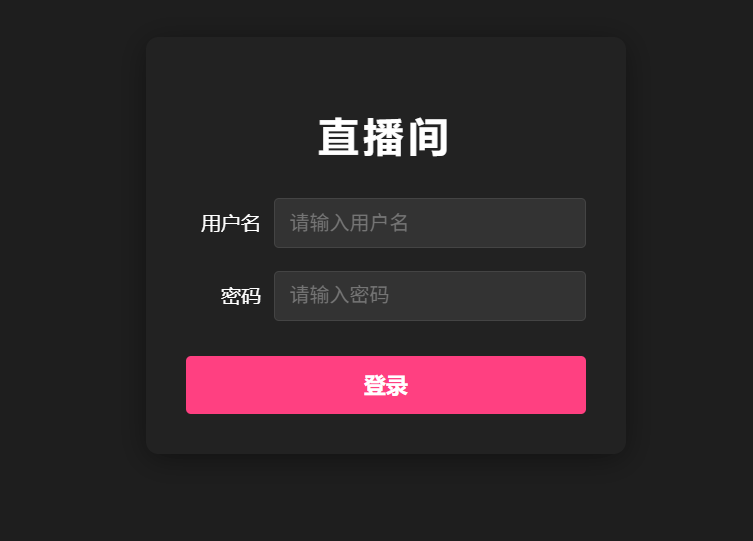
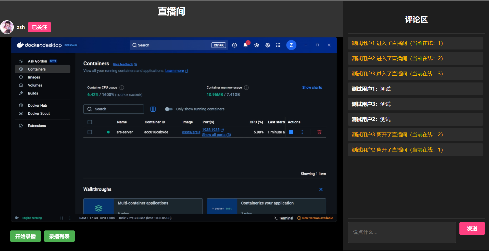
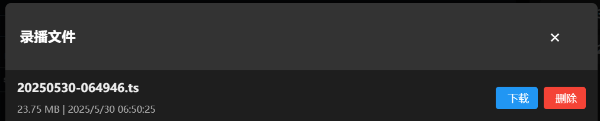

# 直播流媒体技术方案

## 技术栈概览

### 前端技术
- **框架**: Vue 3 + Vite
- **流媒体播放**: HLS.js
- **播放器**: video.js

### 后端技术
- PHP (通过 Laragon 运行)

### 流媒体基础设施
- **服务器**: Docker 容器运行的 SRS 流媒体服务器
- **推流工具**: OBS Studio
- **媒体处理**:FFmpeg

---

## 快速使用指南

```bash
# 启动SRS流媒体服务器容器
# 先下载Docker Desktop
docker run -d \
  --name srs-server \
  -p 1935:1935 \
  -p 8080:8080 \
  -p 1985:1985 \
  ossrs/srs:4

# 下载Laragon，并且将backend的内容放到laragon/www/live-room/中
# 将frontend的内容下载下来
# 下载FFmpeg

cd frontend
npm install

修改VideoPlayer.vue中的onMounted中的src，按照ip进行修改（ipconfig获取ip）

修改App.vue中的connectWebSocket的ws，按照ip进行修改，
端口号是WebSocket监听的端口号

修改api.php中的config的路径信息

#下载OBS
设置OBS的直播属性
自定义服务
服务器：rtmp://localhost:1935/live
流推码：livestream
#在api.php、VideoPlayer.vue中都需要根据流推码来写路径
#如果修改流推码就需要相应修改两个代码中的涉及到livestream的路径

#启动项目
开启docker容器、Laragon
开启OBS进行直播
打开powershell
cd .../live_room
node ws-server.cjs
cd .../frontend
npm run dev
```
---
## 实测效果





